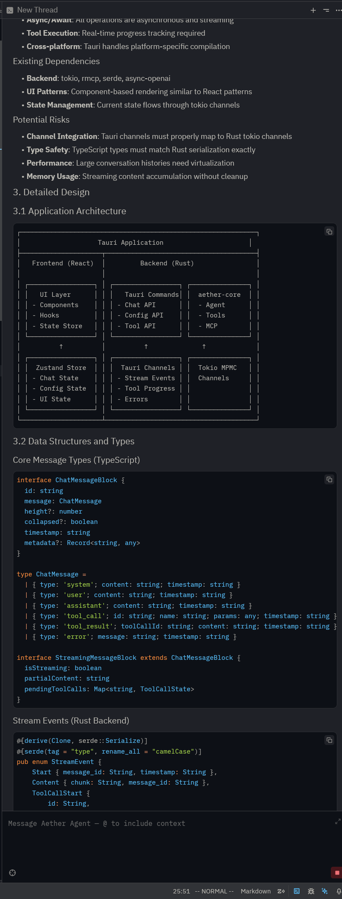

# aether-acp

[Agent Client Protocol (ACP)](https://agentclientprotocol.com/overview/introduction) server for Aether agents, enabling AI coding assistance using in editors like Zed.



## Quick Start

### 1. Build the Server

From the workspace root:

```bash
cargo build --release -p aether-acp
```

### 2. Run `mkdir -p ~/.aether/commands` to create a slash command directory (the agent currently needs this)

The binary will be located at `target/release/aether-acp`. So if you checked out the aether repository at `$HOME/bob/aether`, the binary will be at `$HOME/bob/aether/target/release/aether-acp`.

### 3. Choose a LLM Model

Aether supports multiple LLM providers using the a `provider:model` string format. Choose a model based on your needs:

**Supported Providers:**
- **Anthropic** - Claude models via Anthropic API
  - Example: `anthropic:claude-sonnet-4-5-20250929`
  - Requires: `ANTHROPIC_API_KEY` environment variable

- **OpenRouter** - Access to many models via OpenRouter
  - Example: `openrouter:moonshotai/kimi-k2-thinking`,
  - Requires: `OPENROUTER_API_KEY` environment variable

- **ZAI** - Models via ZAI API
  - Example: `zai:GLM-4.6`
  - Requires: `ZAI_API_KEY` environment variable

- **Ollama** - Local models via Ollama server
  - Example: `ollama:llama3.2`, `ollama:qwen2.5-coder:32b`
  - Requires: Ollama running locally (default: `http://localhost:11434`)
  - No API key required

- **Llama.cpp** - Local models via llama.cpp server
  - Example: `llamacpp` (no model name needed - serves the model loaded at startup)
  - Requires: llama.cpp server running locally (default: `http://localhost:8080/v1`)
  - No API key required

### 4. Configure Your Editor

#### Zed

Add the following to your Zed `settings.json` (Main Menu → "Open Settings File"):

```json
{
  "agent_servers": {
    "Aether Agent": {
      "command": "/path/to/aether/target/release/aether-acp",
      "args": [
        "--model",
        "zai:GLM-4.6",
        "--mcp-config",
        "/path/to/aether/mcp.json"
      ],
      "env": {
        "RUST_LOG": "debug",
        "ZAI_API_KEY": "your-api-key-here"
      }
    }
  }
}
```

To use the agent:

1. Open the [Agent Panel](https://zed.dev/docs/ai/agent-panel)
2. Click the plus icon
3. Select "New Aether Agent Thread"

**Important:** Update the paths and configuration:
- `command`: Full path to your built `aether-acp` binary
- `--mcp-config`: Path to your MCP configuration file
- `<PROVIDER>_API_KEY`: Set the appropriate API key environment variable for your model provider:
  - `ZAI_API_KEY` for `zai:*` models
  - `ANTHROPIC_API_KEY` for `anthropic:*` models
  - `OPENROUTER_API_KEY` for `openrouter:*` models
  - `OLLAMA_API_KEY` for `ollama:*` models (optional)

### 5. Goodies

#### MCP servers

The `mcp.json` file in this repo currently configures two MCP servers and looks like this:

```json
{
  "servers": {
    "coding": {
      "type": "in-memory"
    },
    "plugins": {
      "type": "in-memory",
      "args": ["--dir", "$HOME/.aether"]
    }
  }
}
```

Both are configured to run `in-memory`. The `coding` server gives the agent Claude Code style filesystem tools (read, write, bash etc). The `plugins` server gives the agent Claude Code style plugin features -- e.g. custom slash commands (support is nascent here)

#### Slash commands

You can put markdown files in `~/.aether/commands` to define custom slash commands ala Claude Code.

**Example:** Create `~/.aether/commands/plan.md`:

```markdown
---
description: Create a detailed implementation spec for a task
---

You are an expert software architect tasked with creating a comprehensive technical specification.

# Task
$ARGUMENTS

# Your Mission
Create a detailed, actionable specification that a senior engineer can use to implement this task...
```

**Parameter Syntax:**
- `$ARGUMENTS` - The full argument string (e.g., `/plan add user auth` → "add user auth")
- `$0`, `$1`, `$2`, etc. - Individual positional arguments (e.g., `/plan add user auth` → $0="add", $1="user", $2="auth")

**Usage in Zed:**
Type `/plan add user authentication` in the agent panel to expand the command with your task description.

## Logs

Logs are written to `--log-dir` (default: `/tmp/aether-acp-logs/`). Set `RUST_LOG` environment variable to control log levels (e.g., `debug`, `info`, `warn`, `error`).
