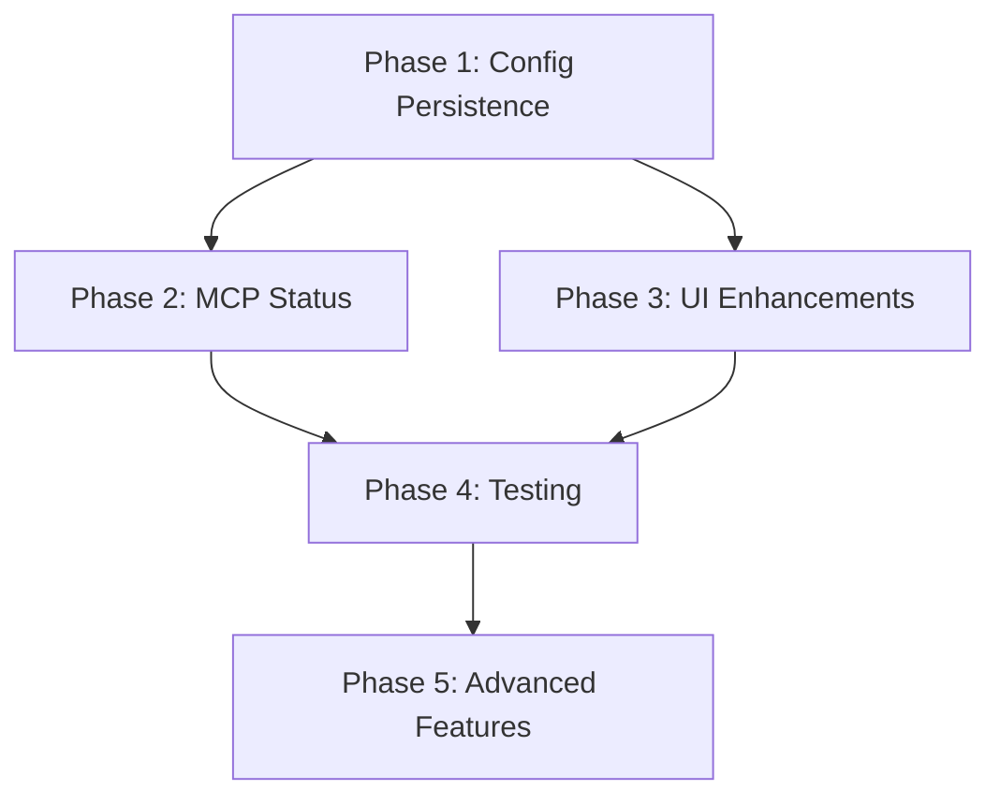

# Aether Desktop TODO Implementation Plan

This document outlines the implementation plan for completing the TODO items and missing features identified in the aether-desktop codebase.

## Overview

The TODOs fall into several categories:
1. **Configuration Management** - File-based config persistence
2. **User Interface Enhancements** - Toast notifications and markdown rendering
3. **MCP Server Integration** - Status tracking and management
4. **Testing & Quality** - Comprehensive test coverage

## Phase 1: Configuration Persistence (High Priority)

### 1.1 Backend Configuration File Management
**Files:** `src-tauri/src/commands/config.rs`

**Tasks:**
- [ ] Create config file structure and location handling
- [ ] Implement `load_config_from_file()` function
- [ ] Implement `save_config_to_file()` function  
- [ ] Add config validation and error handling
- [ ] Support config file migration/versioning

**Implementation Details:**
- Use `~/.config/aether/config.json` as default location
- Support XDG Base Directory specification on Linux
- Implement atomic writes to prevent corruption
- Add backup/restore functionality

**Estimated Time:** 4-6 hours

### 1.2 Update Configuration Commands
**Files:** `src-tauri/src/commands/config.rs:38,59`

**Tasks:**
- [ ] Replace hardcoded config in `get_config()` with file loading
- [ ] Update `update_config()` to persist to file
- [ ] Add error handling for file I/O operations
- [ ] Implement config validation

**Estimated Time:** 2-3 hours

## Phase 2: MCP Server Status Tracking (High Priority)

### 2.1 MCP Server Status Implementation  
**Files:** `src-tauri/src/commands/config.rs:96`

**Tasks:**
- [ ] Create MCP server connection tracking system
- [ ] Implement real-time status monitoring
- [ ] Add server health checks and heartbeat
- [ ] Update `get_app_status()` to return actual server states
- [ ] Add server restart/reconnection logic

**Implementation Details:**
- Track connection state per MCP server
- Monitor server process health
- Handle connection failures gracefully
- Provide detailed error information

**Estimated Time:** 6-8 hours

## Phase 3: User Interface Enhancements (Medium Priority)

### 3.1 Toast Notification System
**Files:** 
- `src/components/ChatInput.tsx:35`
- `src/components/ChatView.tsx:30`

**Tasks:**
- [ ] Install and configure toast library (e.g., `react-hot-toast`)
- [ ] Create toast notification wrapper component
- [ ] Add error toast for message send failures
- [ ] Add success toast for clipboard operations
- [ ] Implement toast positioning and styling

**Implementation Details:**
- Use `react-hot-toast` for consistent UX
- Create custom toast themes matching app design
- Add accessibility support (screen readers)
- Implement toast queue management

**Estimated Time:** 3-4 hours

### 3.2 Markdown Rendering Enhancement
**Files:** `src/components/chat/MarkdownRenderer.tsx:15,24`

**Tasks:**
- [ ] Install `react-markdown` and related plugins
- [ ] Implement syntax highlighting with `react-syntax-highlighter`
- [ ] Add code block copy functionality
- [ ] Support tables, links, and other markdown features
- [ ] Add LaTeX math rendering (optional)
- [ ] Implement responsive design for mobile

**Dependencies:**
```json
{
  "react-markdown": "^9.0.0",
  "react-syntax-highlighter": "^15.5.0",
  "rehype-highlight": "^6.0.0",
  "remark-gfm": "^4.0.0"
}
```

**Implementation Details:**
- Create plugin pipeline for markdown processing
- Implement copy-to-clipboard for code blocks
- Add custom renderers for enhanced components
- Support GitHub Flavored Markdown

**Estimated Time:** 4-5 hours

## Phase 4: Testing & Quality Assurance (Medium Priority)

### 4.1 Backend Tests
**Tasks:**
- [ ] Write tests for config file operations
- [ ] Test MCP server status tracking
- [ ] Add integration tests for chat history
- [ ] Test error handling and edge cases

**Estimated Time:** 6-8 hours

### 4.2 Frontend Tests
**Tasks:**
- [ ] Test toast notification system
- [ ] Test markdown rendering with various inputs
- [ ] Add accessibility tests
- [ ] Test error states and loading states

**Estimated Time:** 4-6 hours

## Phase 5: Additional Enhancements (Low Priority)

### 5.1 Configuration UI
**Tasks:**
- [ ] Create settings panel for config management
- [ ] Add MCP server management interface  
- [ ] Implement config import/export
- [ ] Add config validation UI

**Estimated Time:** 8-10 hours

### 5.2 Advanced Markdown Features
**Tasks:**
- [ ] Add mermaid diagram support
- [ ] Implement LaTeX math rendering
- [ ] Add image rendering and optimization
- [ ] Support custom markdown extensions

**Estimated Time:** 6-8 hours

## Implementation Order & Dependencies



## Success Criteria

### Phase 1 Complete:
- [ ] Configuration persists between app restarts
- [ ] Config validation prevents invalid states
- [ ] Error handling provides clear user feedback

### Phase 2 Complete:
- [ ] MCP server status accurately reflects reality
- [ ] Connection issues are clearly communicated
- [ ] Server management is automated

### Phase 3 Complete:
- [ ] Users receive immediate feedback on actions
- [ ] Markdown content is properly formatted and interactive
- [ ] Code blocks are syntax highlighted with copy functionality

### Phase 4 Complete:
- [ ] All core functionality is tested
- [ ] Edge cases are handled gracefully
- [ ] Performance meets requirements

## Risk Mitigation

**Configuration Corruption:** Implement atomic writes and backup systems
**Performance Impact:** Lazy load markdown plugins and optimize rendering
**Compatibility Issues:** Test across different platforms and configurations
**User Experience:** Provide progressive enhancement and fallbacks

## Timeline Estimate

- **Phase 1:** 1-2 days
- **Phase 2:** 2-3 days  
- **Phase 3:** 1-2 days
- **Phase 4:** 2-3 days
- **Phase 5:** 3-4 days

**Total Estimated Time:** 9-14 days

## Notes

- Prioritize configuration persistence as it's foundational
- MCP server status is critical for debugging user issues
- UI enhancements improve user experience significantly
- Testing ensures reliability and maintainability
- Advanced features can be implemented incrementally